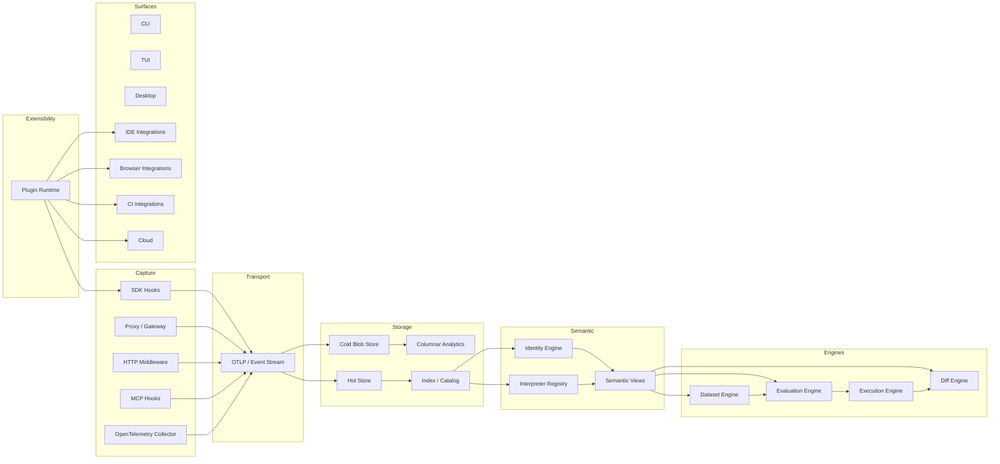

# High-Level Architecture

Glassbox should be organized around the following layers:

Core idea:

- capture gathers facts
- transport moves facts reliably
- storage preserves raw evidence and derived artifacts separately
- identity explains what changed
- semantics are applied at read time
- evaluation decides whether a change is safe
- execution supports re-run and simulation
- plugins connect external ecosystems without hard-coding them into the core

The product should optimize for confidence, not just visibility.
