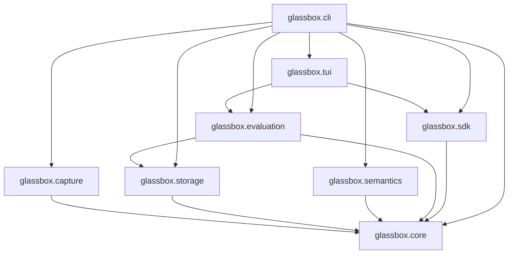

# Dependency Graph

The core architecture is intentionally acyclic.

Notes:

- Core depends on nothing.
- Capture depends only on Core.
- Storage depends only on Core.
- Semantics depends only on Core.
- Evaluation depends on Core and Storage.
- SDK depends only on Core.
- TUI depends only on SDK and Evaluation.
- CLI depends on the full stack.
